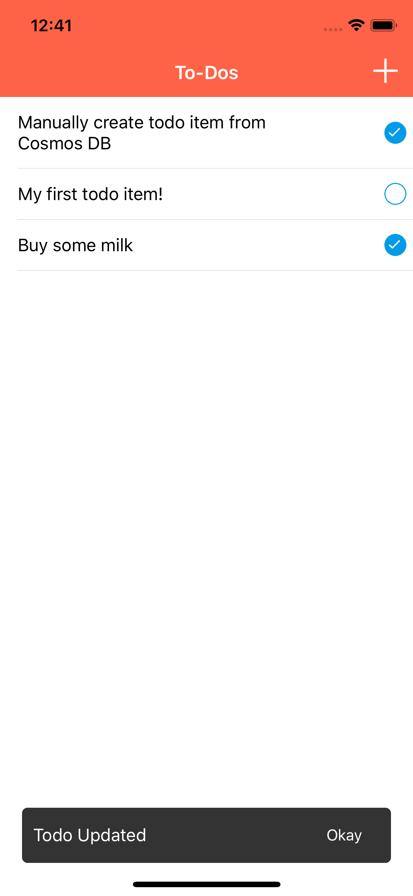
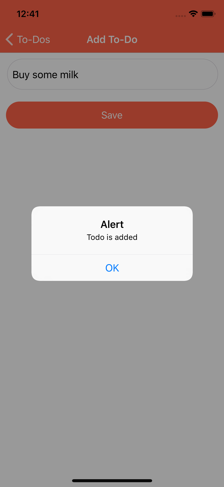
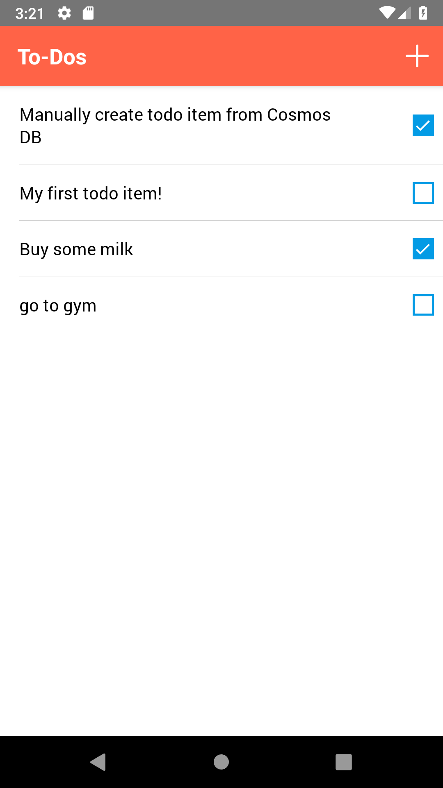
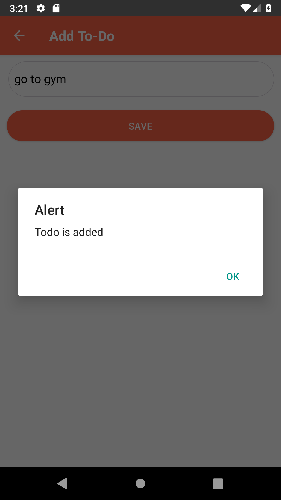

# Azure Cosmos DB with React Native

## Summary

This repository continas samples on how to access **Azure Cosmos DB** service with React Native.

Azure Cosmos DB is a database for building blazing fast, planet scale applications with native support for NoSQL. It was built from the ground up with global distribution and horizontal scale at its core. It offers turnkey global distribution across any number of Azure regions by transparently scaling and replicating your data wherever your users are. Elastically scale your writes and reads all around the globe, and pay only for what you need. Azure Cosmos DB provides native support for NoSQL and OSS APIs including MongoDB, Cassandra, Gremlin and SQL, offers multiple well-defined consistency models, guarantees single-digit-millisecond read and write latencies at the 99th percentile, and guarantees 99.999 high availability with multi-homing anywhere in the world — all backed by industry-leading, comprehensive service level agreements (SLAs).

## Prerequisites

- Azure account

To access Azure Cosmos DB, you'll need an Azure subscription. If you don't already have a subscription, then create a [free account](https://azure.microsoft.com/free) before you begin.

- [Visual Studio Code](https://code.visualstudio.com/)
- [React Native CLI](https://facebook.github.io/react-native/docs/getting-started)
- [React Native Tools](https://marketplace.visualstudio.com/items?itemName=vsmobile.vscode-react-native) for Visual Studio Code
- [Azure Cosmos DB account](https://docs.microsoft.com/en-us/azure/cosmos-db/how-to-manage-database-account)

Once you have you Azure account set, please [create a new Cosmos DB instance](https://azure.microsoft.com/en-us/free/cosmos-db) and copy access keys to be used in the sample. All access to Azure Cosmos DB takes place through a Cosmos DB account. For this quickstart, create a Cosmos DB account using the [Azure portal](https://portal.azure.com/), [Azure PowerShell](https://docs.microsoft.com/en-us/powershell/azure/overview), or [Azure CLI](https://docs.microsoft.com/en-us/cli/azure/install-azure-cli). For help creating the account, see [Manage an Azure Cosmos Account](https://docs.microsoft.com/en-us/azure/cosmos-db/how-to-manage-database-account).

## Run the sample

1. Cosmos DB collection

    - (optional) Create a collection
        - Database id: `to_do`
        - Collection Id: `toDoList`
    - (optional) Populate test data
    - Copy the secrets (endpoint and master key)

2. Update the secrets in the code

    Open [db.js](cosmosdb/react-native/server/db.js) and replace the `endpoint` and the `masterKey` values with the secrets to copied at step #1.

3. Run the API server

    From the root of the samples folder run the following commands:

    ```bash
    cd cosmosdb/react-native/server
    yarn install
    yarn start
    ```

4. Run the node server

    From the root of the samples folder run the following commands:

    ```bash
    cd cosmosdb/react-native
    yarn install
    yarn start
    ```

5. Run the iOS app

    By default, an iOS simulator will be selected as a target for the app. Run the following command to build and package the sample application for iOS

    ```bash
    react-native run-ios
    ```

    Known issue #1: [unable to start simulator](https://github.com/facebook/react-native/issues/23282#issuecomment-476439080)

6. Run the Android app

    In order to run the sample application on the Android emulator you need to update the server URL to the preconfigured `10.0.2.2` instead of the localhost address. To do that, please navigate to the [TodoListScreen.js](cosmosdb/react-native/src/screens/TodoListScreen.js#L9) and set the axios baseURL to `http://10.0.2.2:3036`. Please make sure youe Android Emulator is started and run the following command

    ```bash
    react-native run-android
    ```

    Alternatively, you can run the app on a selected Android emulator or device by specifying the device id. You can get list of connected devices by running the adb command

    ```bash
    adb devices
    react-native run-android --deviceId=<device_id_from_previous_output>
    ```

## Screenshots







