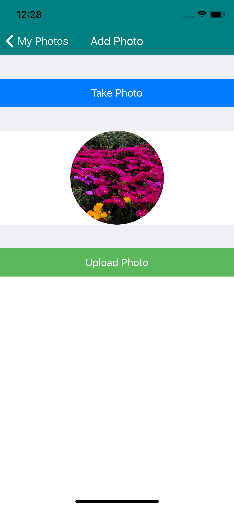
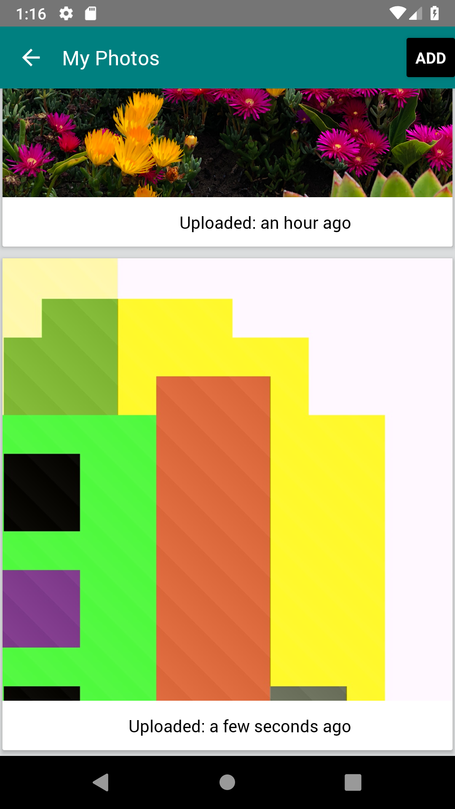
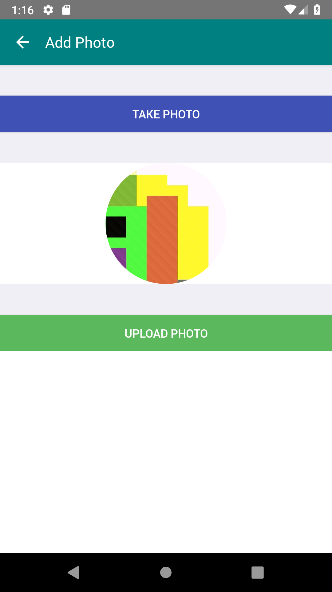

# Azure Storage with React Native

## Summary

This repository continas samples on how to access **Azure Storage** service with React Native.

Azure Storage is a Microsoft-managed service providing cloud storage that is highly available, secure, durable, scalable, and redundant. Azure Storage includes Azure Blobs (objects), Azure Data Lake Storage Gen2, Azure Files, Azure Queues, and Azure Tables.

## Prerequisites

- Azure account

To access Azure Storage, you'll need an Azure subscription. If you don't already have a subscription, then create a [free account](https://azure.microsoft.com/free) before you begin.

- [Visual Studio Code](https://code.visualstudio.com/)
- [React Native CLI](https://facebook.github.io/react-native/docs/getting-started)
- [React Native Tools](https://marketplace.visualstudio.com/items?itemName=vsmobile.vscode-react-native) for Visual Studio Code
- [Azure Storage account](https://docs.microsoft.com/en-us/azure/storage/common/storage-quickstart-create-account)

Once you have you Azure account set, please [create a new Storage account](https://docs.microsoft.com/en-us/azure/storage/common/storage-quickstart-create-account) and copy access keys to be used in the sample. All access to Azure Storage takes place through a Storage account. For this quickstart, create a Storage account using the [Azure portal](https://portal.azure.com/), [Azure PowerShell](https://docs.microsoft.com/en-us/powershell/azure/overview), or [Azure CLI](https://docs.microsoft.com/en-us/cli/azure/install-azure-cli). For help creating the account, see [Create an Azure Stoage Account](https://docs.microsoft.com/en-us/azure/storage/common/storage-quickstart-create-account).

## Run the sample

1. Storage container

    - Create a container
        - name: `azuresamples-container`
        - public access level: `container`
    - (optional) Upload test images
    - Copy the secrets (endpoint and access key)

2. Update the secrets in the code

    Open [api/index.js](storage/react-native/api/index.js#L37-L39) and replace the `endpoint`, `container` and the `accessKey` values with the secrets copied at step #1.

3. Run the API server

    From the root of the samples folder run the following commands:

    ```bash
    cd storage/react-native/api
    yarn install
    yarn start
    ```

4. Run the node server

    From the root of the samples folder run the following commands:

    ```bash
    cd storage/react-native
    yarn install
    yarn start
    ```

5. Run the iOS app

    By default, an iOS simulator will be selected as a target for the app. Run the following command to build and package the sample application for iOS

    ```bash
    react-native run-ios
    ```

    Known issue #1: [unable to start simulator](https://github.com/facebook/react-native/issues/23282#issuecomment-476439080)

6. Run the Android app

    In order to run the sample application on the Android emulator you need to update the server URL to the preconfigured `10.0.2.2` instead of the localhost address. To do that, please navigate to the [HomeScreen.js](storage/react-native/src/screens/HomeScreen.js#L30) and [UploadScreen.js](storage/react-native/src/screens/UploadScreen.js#L7) and set the `BASE_API` to `http://10.0.2.2:3000/api/blob`. Please make sure youe Android Emulator is started and run the following command

    ```bash
    react-native run-android
    ```

    Alternatively, you can run the app on a selected Android emulator or device by specifying the device id. You can get list of connected devices by running the adb command

    ```bash
    adb devices
    react-native run-android --deviceId=<device_id_from_previous_output>
    ```

## Screenshots






